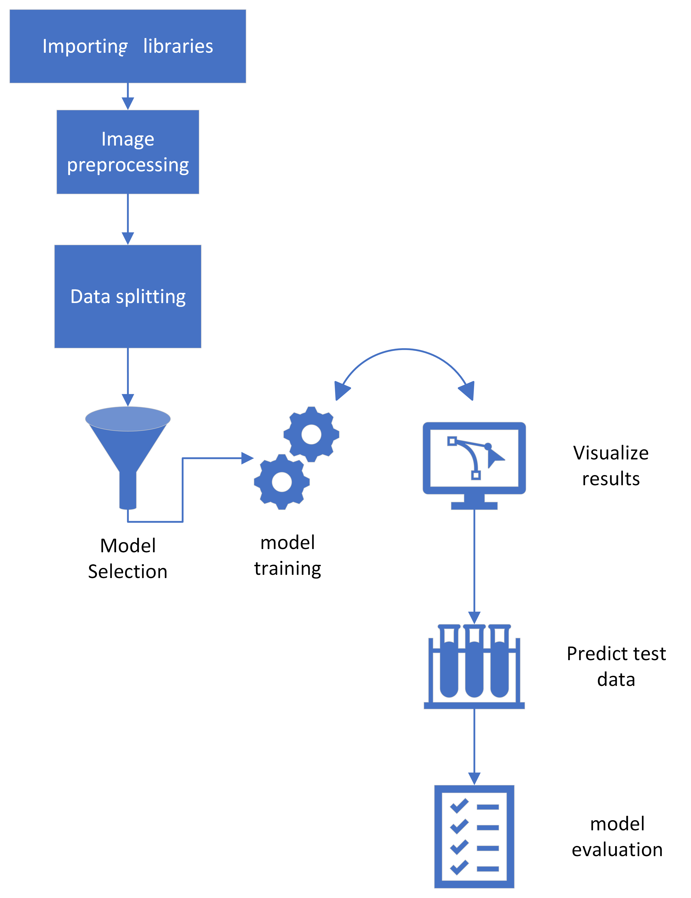

## Image Classification
Image classification is the process of categorizing images into one or more predefined classes. The primary objective of this image classification project is to develop a robust model capable of accurately predicting the class of previously unseen images. To accomplish this, a machine learning model is trained using a diverse dataset of labeled images. Preprocessing techniques, such as image resizing and normalization, are applied to enhance the performance of the model.
## Approach

A systematic approach as shown in the figure below is followed in the development of the project.

- The following are the **libraries** that are worked with in this project

    Numpy, OpenCV, Keras, ScikitLearn
- The following **preprocessing techinques** are used in this project
    
    Feature extraction using HOG (Histogram of Oriented Gradients) 

    Dimensionality Reduction using PCA (Principal Component Analysis)
- Data is **split** using the following techinques

    train_test_split of Scikitlearn

    ImageDataGenerator from keras
- The following are list of **models** that are worked on this project

    CNN with transfer learning implemented using deep learning keras models VGG16, InceptionV3 and Xception.

    KNN, SVM, Random Forest Classifier
 - The following are few of the **parameters** those are tuned for increasig model efficiency.

    Learning rate, Batch size, Number of Epochs, Optimizer
- Accuracy and F-1 scores are used for model performance **evaluation**.

## Learnings 

- In our data set we have 16 classes for the model to classify, however SVMs inherently do binary classification therefore to perform multi-class classification using this technique we need to use procedures such as the following:

    OVR: In One-Vs-Rest we train the binary classifier for each class vs the rest other classes combined.

    OVO: In One-Vs-One we train the binary classifier for every possible pair of classes.

- GridSearchCV: This is a process of performing hyperparameter tuning to find the optimal values for a given model. I have made use of this process to find the optimal value of the parameters passed as input for the KNN model.

- Transfer learning is a process of utilizing a CNN that is already trained and optimized in the domain of image classification for the task of categorizing different images. In this project, I have made use of VGG16, Xception, and InceptionV3 to perform transfer learning. I have replaced the default top model with new customized fully connected layers that would output 16 classes. During training, a few Layers of CNN are allowed to retrain to perform fine-tuning.
